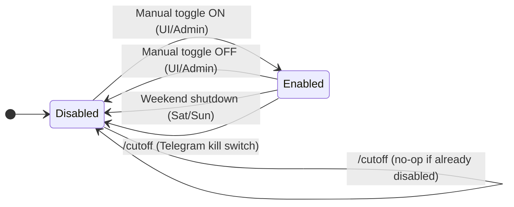

### Bot Gating Schematics

This document explains what enables or disables each subsystem (scraping, analysis, trading) and when state changes happen. It consolidates the logic controlled by `bot_enabled` and `overnight_enabled`, with trading restricted to market hours by definition. Weekend shutdowns and the Telegram kill switch are also covered.

---

#### Key Controls

- **bot_enabled**: Master ON/OFF for automation. If False, automated scraping, analysis, and trade flows do not run. Manual test paths can bypass.
- **overnight_enabled**: If True, collect posts while the market is closed and process them immediately at market open (`process_overnight_posts`).

---

#### High-Level Matrix: When Subsystems Run

| Subsystem  | Conditions |
|------------|---------------------------|
| Scraping   | `bot_enabled == True` (bypass if `manual_test=True`) |
| Analysis   | `bot_enabled == True` (bypass if `manual_test=True`) |
| Open Trades| `bot_enabled == True` AND Market Open AND daily/concurrency limits OK |
| Overnight Processing at Open | `overnight_enabled == True` AND Market open (runs immediately at bell via scheduled tasks). |

Notes:
- Weekend shutdown disables automation on Sat/Sun via scheduled task.
- Kill switch (`/cutoff`) sets `bot_enabled=False`.

---

#### State Transitions of `bot_enabled`



References:
- Weekend shutdown: `core/tasks.py: disable_bot_on_weekends`
- Kill switch: `telegram_bot/bot.py: cutoff_command`

---

#### What Triggers Overnight Processing

```mermaid
flowchart TD
    A[Market Closed] -->|overnight_enabled==True| B[Scrapers tag Post.overnight=True]
    B --> C[Analyses created/pending]
    C -->|Market Opens| D{Trigger at open}
    D --> E[process_overnight_posts]  %% triggered by scheduled tasks at open
    E --> F[Entry confirmation in first N minutes]
    F --> G{Pass thresholds?}
    G -->|Yes| H[Open trade via normal flow]
    G -->|No| I[Mark stale / skip]
```

References:
- Tagging posts overnight (multiple scrapers): `core/tasks.py` (creation paths set `Post.overnight=True` when market is closed and `overnight_enabled=True`).
- Open-window processing: `core/tasks.py: process_overnight_posts` (gated by `overnight_enabled`).

---

#### The Canonical Trading Gate

All openings of new trades are governed by `get_gate()` and limits:

1) `get_gate()`
   - Returns a state dict with `mode`, booleans (`allow_scrape`, `allow_overnight_processing`, `allow_trading`, etc.), and `backlog_count`.
   - Trading is allowed only when `bot_enabled=True` and market is open.
2) `check_daily_trade_limit()` and concurrent exposure limits
   - Enforces `max_daily_trades`, `max_concurrent_open_trades`, and exposure.

References:
- `core/utils/gating.py: get_gate`, `core/tasks.py: check_daily_trade_limit`, trade creation paths.

---

#### Event Timeline (Weekdays vs Weekends)

- Weekday, before open:
  - Overnight posts accumulate if `overnight_enabled=True`.
- Market opens:
  - If `overnight_enabled=True`, overnight processing is triggered immediately by scheduled tasks.
- Market hours:
  - Automation runs when `bot_enabled==True`.
  - New trades must pass gate and limits.
- Market closes:
  - If `intraday_trading=True`, pre-close enforcement may dispatch close-all within the configured window.
- Weekend (Sat/Sun):
  - `disable_bot_on_weekends` force-disables automation.

---

#### Practical Scenarios

- Kill switch used mid-week:
  - Sets `bot_enabled=False`.
  - Nothing resumes until manual re-enable.

- Market-hours-only trading:
  - Trade opens are blocked when market is closed regardless of `bot_enabled`.

---

#### Source Pointers (for deeper inspection)

- Automation and market status:
  - `core/tasks.py`: `disable_bot_on_weekends`, `is_market_open_broker_aware`, `market_just_opened`
- Trading gates and limits:
  - `core/tasks.py`: `is_trading_allowed`, `check_daily_trade_limit`, trade creation paths
- Overnight flow:
  - `core/tasks.py`: scrapers tagging `Post.overnight`, `process_overnight_posts`
  - `OVERNIGHT_FLOW.md`: detailed overnight sequence
- Telegram control:
  - `telegram_bot/bot.py`: `/cutoff`

---

If you want, we can add a small dashboard widget that derives and displays the current composite state: `bot_enabled`, market status, and whether overnight processing is expected at the next open.


