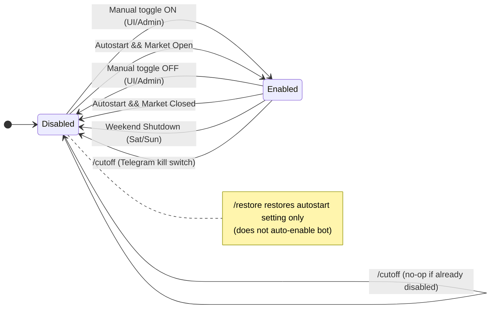
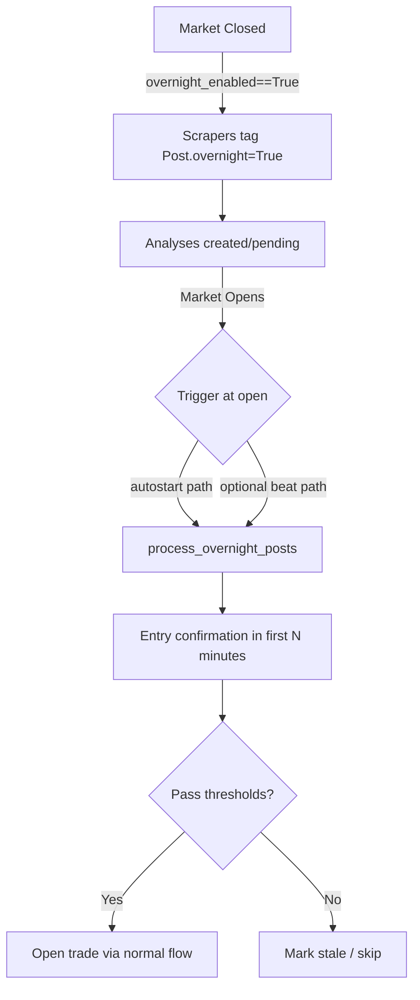

### Bot Gating Schematics

This document explains what enables or disables each subsystem (scraping, analysis, trading) and when state changes happen. It consolidates the logic controlled by `bot_enabled`, `autostart`, `trading_enabled`, `market_hours_only`, and `overnight_enabled`, plus weekend shutdowns and Telegram kill switch.

---

#### Key Flags and What They Do

- **bot_enabled**: Master ON/OFF for automation. If False, automated scraping, analysis, and trade flows do not run. Manual test paths can bypass.
- **trading_enabled**: Master ON/OFF for opening trades (does not control scraping/analysis). Checked via `is_trading_allowed()`.
- **market_hours_only**: If True, blocks opening trades when the market is closed (broker-aware check in `is_trading_allowed()`).
- **autostart**: If True, automatically toggles `bot_enabled` at market open/close (via `enforce_bot_autostart`).
- **overnight_enabled**: If True, collect posts while the market is closed and process them immediately at market open (`process_overnight_posts`).

---

#### High-Level Matrix: When Subsystems Run

| Subsystem  | Required Flags/Conditions |
|------------|---------------------------|
| Scraping   | `bot_enabled == True` (bypass if `manual_test=True`) |
| Analysis   | `bot_enabled == True` (bypass if `manual_test=True`) |
| Open Trades| `bot_enabled == True` AND `trading_enabled == True` AND (if `market_hours_only==True` then Market Open) AND daily/concurrency limits OK |
| Overnight Processing at Open | `overnight_enabled == True` AND Market just opened (N-minute window). Triggered typically from autostart open event; can also be scheduled independently. |

Notes:
- Weekend shutdown disables `bot_enabled` on Sat/Sun regardless of flags.
- Kill switch (`/cutoff`) sets `bot_enabled=False` and `autostart=False`.
- `/restore` restores `autostart` to its previously saved value; `bot_enabled` remains as-is.

---

#### State Transitions of bot_enabled (who can flip it, and when)

References:
- Autostart toggler: `core/tasks.py: enforce_bot_autostart`
- Weekend shutdown: `core/tasks.py: disable_bot_on_weekends`
- Kill switch/restore: `telegram_bot/bot.py: cutoff_command, restore_command`

---

#### What Triggers Overnight Processing

References:
- Tagging posts overnight (multiple scrapers): `core/tasks.py` (creation paths set `Post.overnight=True` when market is closed and `overnight_enabled=True`).
- Open-window processing: `core/tasks.py: process_overnight_posts` (gates on `overnight_enabled` and just-open window).
- Autostart trigger hooks overnight at open: `core/tasks.py: enforce_bot_autostart`.

---

#### The Canonical Trading Gate

All openings of new trades should funnel through these checks:

1) `is_trading_allowed()`
   - True only if `trading_enabled==True` and, when `market_hours_only==True`, market is open (broker-aware clock).
2) `check_daily_trade_limit()` and concurrent exposure limits
   - Enforces `max_daily_trades`, `max_concurrent_open_trades`, and exposure.

References:
- `core/tasks.py: is_trading_allowed`, `check_daily_trade_limit`, `create_new_trade` path checks.

---

#### Event Timeline (Weekdays vs Weekends)

- Weekday, before open:
  - If `autostart=True`, nothing toggles yet; bot may be Disabled or Enabled by manual choice.
  - Overnight posts accumulate if `overnight_enabled=True`.
- Market opens:
  - If `autostart=True`, `bot_enabled` is set to True.
  - If `overnight_enabled=True`, overnight processing is triggered (from autostart or a direct beat task near open).
- Market hours:
  - Automation runs when `bot_enabled==True`.
  - New trades require `trading_enabled==True` and pass `is_trading_allowed()` and limits.
- Market closes:
  - If `autostart=True`, `bot_enabled` is set to False.
  - If `intraday_trading=True`, pre-close enforcement may dispatch close-all within the configured window.
- Weekend (Sat/Sun):
  - `disable_bot_on_weekends` force-disables `bot_enabled`.
  - Autostart does not turn it back on over the weekend because market is closed.

---

#### Practical Scenarios

- Autostart OFF, Overnight ON:
  - Bot will not auto-enable at open; overnight processing won’t run unless separately scheduled.
  - Use a beat schedule for `process_overnight_posts` near open.

- Kill switch used mid-week:
  - Sets `bot_enabled=False` and `autostart=False`.
  - Nothing auto-starts until `/restore` and/or manual re-enable.

- Market-hours-only trading:
  - Trade opens are blocked when market is closed regardless of `bot_enabled`.

---

#### Source Pointers (for deeper inspection)

- Automation toggles and market status:
  - `core/tasks.py`: `enforce_bot_autostart`, `disable_bot_on_weekends`, `is_market_open_broker_aware`, `market_just_opened`
- Trading gates and limits:
  - `core/tasks.py`: `is_trading_allowed`, `check_daily_trade_limit`, trade creation paths
- Overnight flow:
  - `core/tasks.py`: scrapers tagging `Post.overnight`, `process_overnight_posts`
  - `OVERNIGHT_FLOW.md`: detailed overnight sequence
- Telegram control:
  - `telegram_bot/bot.py`: `/cutoff` and `/restore`

---

If you want, we can add a small dashboard widget that derives and displays the current composite state: `bot_enabled`, `autostart`, market status, `trading_enabled`, `market_hours_only`, and whether overnight processing is expected at the next open.

