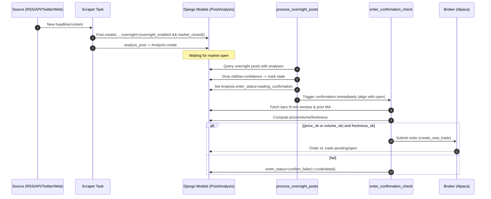
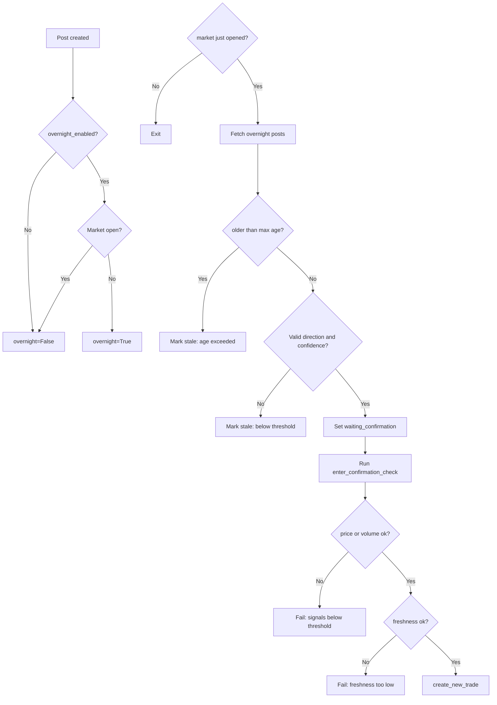

# Overnight Flow - News Trader

This document explains how "overnight" posts are tagged, persisted, and processed at market open, and how confirmation and freshness interact. It also includes diagrams of the flow.

## TL;DR
- A post is tagged `overnight=True` when it is created while the market is closed AND `TradingConfig.overnight_enabled` is True.
- At market open, `process_overnight_posts` picks recent, confident analyses linked to `overnight=True` posts and immediately runs entry confirmation for the first N minutes after the open.
- Old overnight posts (older than `overnight_max_age_hours`) are marked stale and skipped.

---

## Key Configuration
- `TradingConfig.overnight_enabled` (bool): master switch for overnight collection and open processing.
- `TradingConfig.overnight_reduce_sl_factor` (float): reduces stop-loss at open for overnight entries (e.g., 0.5 = 50%).
- `TradingConfig.overnight_max_age_hours` (int, default 12): discard overnight posts older than this at open.
- `TradingConfig.enter_confirm_window_minutes` (int, default 5): N-minute confirmation window starting at open for overnight posts.
- `TradingConfig.freshness_decay_constant_min` (float, default 10): decay for exp(-delay/decay). Special cases: 0.0 during market closed; 1.0 when market just opened for overnight posts.

## Where overnight is set
- All scraping paths set `Post.overnight=True` when:
  - `overnight_enabled` is True, and
  - `is_market_open_broker_aware()` returns False at creation time.

These include: RSS (`_scrape_rss_feed`), API (`_scrape_api_source`), Twitter (`scrape_twitter_profile_task` and periodic), and Playwright/generic browser path (`_scrape_with_browser`) as well as its DB fallback paths.

## Persistence and signals
- Post fields: `overnight` (bool), `is_stale` (bool), `stale_reason` (str), `published_at` (optional).
- Analysis fields updated by confirmation: `enter_checked_at`, `enter_price_change_n_pct`, `enter_volume_ratio`, `enter_volume_n`, `enter_volume_ma`, `freshness_value`, `enter_status`, `enter_failure_code`, `enter_failure_detail`.

## Market-open processing
- Task: `process_overnight_posts`
  - Runs only when `overnight_enabled=True` and `market_just_opened(N)` is True.
  - Selects `Post(overnight=True, is_stale=False, analysis__isnull=False)` ordered by analysis confidence.
  - Drops posts older than `overnight_max_age_hours` (sets `is_stale=True`, `stale_reason='overnight_age_exceeded'`).
  - Drops analyses that are not buy/sell or below `min_confidence_threshold` (stale reason: `below_confidence_or_hold`).
  - For the rest, sets `Analysis.enter_status='waiting_confirmation'` and triggers `enter_confirmation_check` immediately so the N-minute window aligns with market open.

## Entry confirmation logic (summary)
- Window: N minutes from `detection_time`.
  - For overnight posts at open, `detection_time = get_today_market_open_utc()`.
- Signals:
  - Price change over N minutes (signed by direction)
  - Volume spike ratio (N bars vs. prior M-bar MA)
  - Freshness
- Decision: trade passes when `(price_ok OR volume_ok) AND freshness_ok`.
- Failures set codes such as:
  - `no_data` (insufficient bars/MA history after window)
  - `freshness_below_threshold`
  - `price_below_threshold`, `volume_below_threshold`, or `price_and_volume_below_threshold`

## Freshness rules
- If market closed when computed: `freshness = 0.0`.
- If overnight and market just opened (within N): `freshness = 1.0`.
- Else: `freshness = exp(-delay_min / freshness_decay_constant_min)`.
- Persisted to `Analysis.freshness_value` when confirmation runs.

---

## Sequence (Mermaid)

## Flowchart (Mermaid)

---

## Operational tips
- If you see many "No market data (final)" at open, consider:
  - Lowering `enter_volume_ma_window` or `enter_confirm_window_minutes`.
  - Using more liquid symbols (tracked list), or enabling `allow_untracked_symbols` only for testing.
- Overnight age is enforced by `overnight_max_age_hours`; increase to review older posts at open.
- Dashboard clarifies progress states such as "Waiting market open", "Waiting bars", and "No market data (final)".

## Troubleshooting checklist
- Overnight tag missing while market closed
  - Confirm `overnight_enabled=True`.
  - Verify Alpaca credentials are configured and `Market: Closed` appears on the dashboard.
  - Ensure the post path is one of the supported scrapers (RSS/API/Twitter/Web). All creation paths set `overnight` consistently.
- Freshness shows 0.000 unexpectedly
  - Confirm the computation ran during market closed (forced 0.0) or check whether it was computed at a later time.
- Items disappear from Flow Tracker
  - Flow Tracker shows the most recent 200 analyses; overnight-specific pruning also marks items stale after `overnight_max_age_hours`.

---

## References (code)
- `core/tasks.py`: `process_overnight_posts`, `enter_confirmation_check`, `is_market_open_broker_aware`, `market_just_opened`, scrapers.
- `core/models.py`: `TradingConfig` (overnight fields), `Post`, `Analysis`, `Trade`.
- `core/views.py`: Flow Tracker progress messages and freshness display.

---

Maintainers: update this document whenever the overnight logic, thresholds, or confirmation policy changes.
