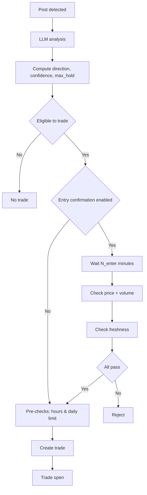
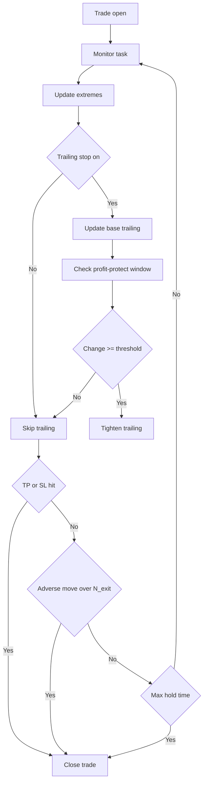

## Trade Strategy Overview

This document summarizes the current entry and exit logic used by the system. It includes concise flow diagrams and the key configuration knobs with defaults.

### Entry logic (high level)
- Direction and confidence are computed by the LLM-driven scoring.
- A trade is eligible only if:
  - direction ∈ {buy, sell}
  - confidence ≥ `min_confidence_threshold`
  - `max_holding_time_hours` was computed
- If `enter_confirmation_enabled` is true (default: true), the system waits for N minutes and checks both price/volume confirmations and freshness before opening a trade.

Entry confirmations and freshness:
- Price confirmation: signed price change over `enter_confirm_window_minutes` ≥ `enter_price_change_threshold_pct` (default 0.2%).
- Volume confirmation: `volume_N / volume_MA` ≥ `enter_volume_multiplier_threshold` (default 1.5), with MA over `enter_volume_ma_window` (default 20 bars).
- Freshness: `exp(-delay_minutes / freshness_decay_constant_min)` ≥ `freshness_threshold` (defaults: 10 min, 0.5).

### Exit and monitoring logic (high level)
- Periodic monitor checks for TP/SL hits, dynamic adverse-move exits, max-hold timeout, and trailing stop management.

Exit triggers:
- Take‑profit / Stop‑loss hit: price‑based or percent‑based triggers.
- Dynamic exit: signed price change over `dynamic_exit_window_minutes` < −`dynamic_exit_drawdown_tolerance_pct` (defaults: 5 min, 0.3%).
- Max holding time: close when `max_holding_time_hours` reached.

Trailing stop management:
- Base trailing stop (if enabled) uses `trailing_stop_distance_percentage` and activates after `trailing_stop_activation_profit_percentage` profit.
- Profit‑protect tightening: if signed change over `profit_protect_window_minutes` ≥ `profit_protect_threshold_pct` (default 0.7%), tighten trailing distance to `profit_protect_trailing_distance_pct` (default 0.2%).

### Key configuration knobs (selected)
- Entry confirmation
  - `enter_confirmation_enabled` (default true)
  - `enter_confirm_window_minutes` (default 5)
  - `enter_price_change_threshold_pct` (default 0.2)
  - `enter_volume_ma_window` (default 20)
  - `enter_volume_multiplier_threshold` (default 1.5)
  - `freshness_decay_constant_min` (default 10 minutes)
  - `freshness_threshold` (default 0.5)
- Exit/dynamic controls
  - `dynamic_exit_window_minutes` (default 5)
  - `dynamic_exit_drawdown_tolerance_pct` (default 0.3)
  - `max_position_hold_time_hours` (default 24)
- Trailing stop
  - `trailing_stop_enabled` (default false)
  - `trailing_stop_distance_percentage` (default 1.0)
  - `trailing_stop_activation_profit_percentage` (default 0.0)
  - Profit‑protect: `profit_protect_threshold_pct` (default 0.7), `profit_protect_trailing_distance_pct` (default 0.2), `profit_protect_window_minutes` (default 5)

